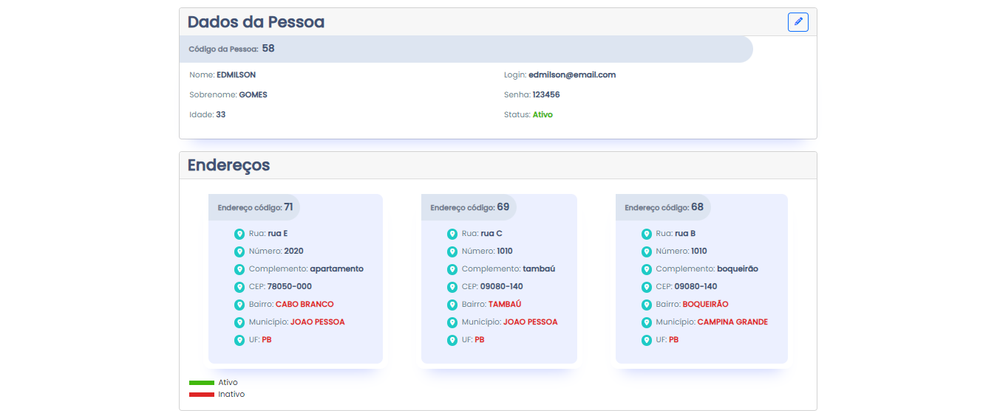

# MeuCadastro.com

## Projeto de Cadastro com Node e Angular

### Listagem Pessoas


### Login


### Cadastro Pessoas


### Dados de pessoas e Endereços



### Back-End - NodeJS


<br/>
<br/>
<ol>
    <li><a href="#sobre">Sobre</a></li>
    <li> <a href="#especificacoes">Especificações</a></li>
    <li> <a href="#comorodaroprojeto">Como Rodar o Projeto?</a> </li>
    <li> <a href="#resultados"> Resultados de Desenvolvimento</a> </li>
    <li> <a href="#desenvolvedor">Desenvolvedor</a></li>
</ol>

<h2 id="sobre">Sobre</h2>

O MeuCadastro.com foi um projeto desenvolvido para um desafio do bootcamp de NodeJS. Se trata de uma aplicação de cadastro de estados, municipios, bairros, endereços e pessoas, utilizando Angular no Font-end, NodeJS no Back-end e Banco de dados Oracle. Nesse projeto não foi utilizado ORM para mapeamento em banco de dados, foi feito com scripts SQL direto no código, afim de estudo e prática de manipulação de banco.

<h2 id="especificacoes">Especificações</h2>

<b>--></b> No backend utilizei:

<ul>
<li>express: v.4.18.2</li>
<li>express-query-int: v.3.0.0</li>
<li>jsonwebtoken: v.8.3.0</li>
<li>typescript: v.5.1.3</li>
<li>OracleDB</li>
<li>express-async-errors: v.3.1.1</li>
<li>argon2: v.0.30.3</li>
</ul>
<b>--></b> No frontend utilizei:
<ul>
<li> angular: v.16.1.0</li>
<li> typescript": v.5.1.3</li>
<li> bootstrap: v.5.3.0</li>
<li> ngx-toastr: v.17.0.2</li>
<li> sweetalert2: v.11.7.12</li>
</ul>

<b>--></b> Você pode verificar todas as dependências utilizadas no projeto no arquivo Package.json tanto na pasta de backend quanto na pasta de frontend.

<h2 id="comorodaroprojeto">Como rodar o projeto?</h2>

<b>Você precisará:</b>

<ul>
    <li>Node JS - versão 16.13.1 ou superior (obrigatório)</li>
    <li>Visual Studio Code (recomendado)</li>
    <li>Git bash </li>
    <li>Windowns 10 ou superior</li>
</ul>

```bash
#Clone este repositório no terminal:
$ git clone https://github.com/edmilsondmx/projeto_cadastro_node_angular.git
```

_OBS: Para que a aplicação funcione como esperado, você deve deixar o frontend e o backend rodando simultaneamente (abra dois terminais):_

```bash

#Com o primeiro terminal, abra a pasta backend e execute o comando:
$ npm install
ou
$ yarn install

#Em seguida inicie a aplicação através do comando abaixo:
$ npm start
ou
$ yarn start

#A aplicação (backend) será aberta na porta:3333

```

Agora que o backend está ativo, é necessário repetir o processo para o frontend:

```bash
#No segundo terminal, abra a pasta frontend e execute o comando:
$ npm install
ou
$ yarn install

#Em seguida inicie a aplicação através do comando abaixo:
$ ng serve -o

#A aplicação(frontend) será aberta na porta:4200 - acesse http://localhost:4200.
```

Agora que tanto o backend quanto o frontend estão rodando, poderá ver a página inicial da listagem de pessoas.

<h2 id="resultados">Resultados de Desenvolvimento</h2>

- Implementação da interface com HTML, CSS, Bootstrap e Angular;
- Sistema de login (autenticação JWT com o banco de dados);
- Sistema de cadastro conectado ao banco de dados;
- Listagem de pessoas cadastradas;
- Listagem de UFs, Municípios e Bairros cadastrados;
- Cadastro com validações em todos os campos;
- Alteração de cadastros com validações.
- Para exclusão, deverá estar logado com token autenticado;
- Validações de cadastro que depende de relacionamentos ativos.
- Cadastro de quantos endereços quiser ao mesmo tempo;

<h2 id="desenvolvedor">Desenvolvedor</h2>

<br>_Desenvolvedor WEB_ | Edmilson Gomes | [Linkedin](https://www.linkedin.com/in/edmilsondmx/)
